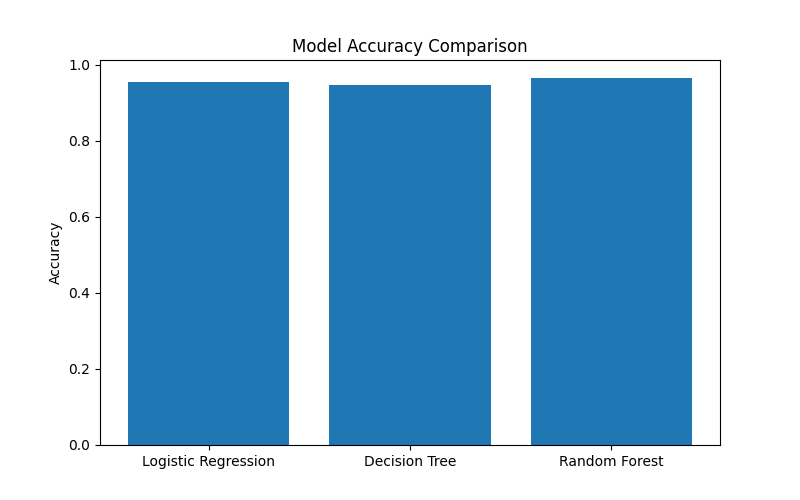

# Credit Scoring Model

## Objective
The objective of this project is to predict creditworthiness using machine learning classification algorithms.

## Algorithms Used
- Logistic Regression
- Decision Tree
- Random Forest

## Evaluation Metrics
- Accuracy
- Precision
- Recall
- F1-Score
- ROC-AUC Score

## Results

| Model | Accuracy |
|---------|---------|
| Logistic Regression | 95.61% |
| Decision Tree | 94.74% |
| Random Forest | 96.49% |

## Best Model
Random Forest achieved the highest accuracy.

## Technologies Used
- Python
- Pandas
- Scikit-Learn
- Matplotlib
## Accuracy Comparison Graph

